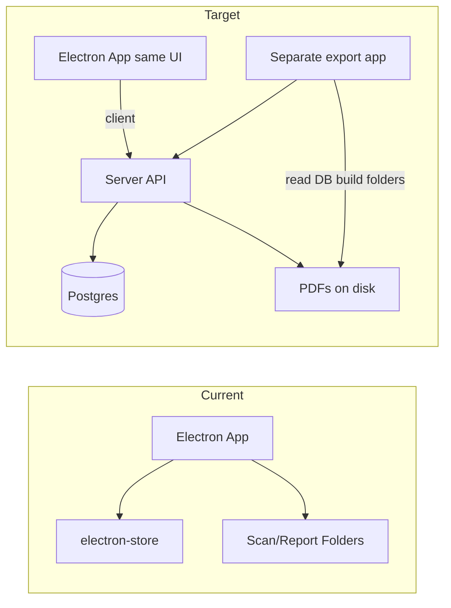

# Decentralized Server + DB Refactor Plan

## Current state (what you have now)

**Not "everything in files"** – there are two layers:

1. **electron-store (JSON on disk)**
  - **[config/store.js](config/store.js)** defines two stores:
    - **settingsStore** (`config`): rider items, night leads, folder paths (scan/report/einkaufsbelege/zeiterfassung), template paths, bestueckung lists, person-name catalogs (secu, tech, andere), wage options, person wages, tech names, catering/pauschale/bestueckung prices.
    - **shiftDataStore** (`shift-data`): current shift formData and currentPhase (VVA/SL).
  - Handlers read/write via `store.get()` / `store.set()` in [handlers/catalogHandlers.js](handlers/catalogHandlers.js), [handlers/settingsHandlers.js](handlers/settingsHandlers.js), [handlers/dataHandlers.js](handlers/dataHandlers.js), [handlers/reportHandlers.js](handlers/reportHandlers.js), [handlers/scannerHandlers.js](handlers/scannerHandlers.js), and [server/secuFormServer.js](server/secuFormServer.js).
2. **Files on disk**
  - **Scans**: PDFs written to `scanFolder` (e.g. `NightclubScans/{formFolder}/{date}/`). NAPS2 and the LAN form server ([server/secuFormServer.js](server/secuFormServer.js)) write here.
  - **On close-shift** ([handlers/reportHandlers.js](handlers/reportHandlers.js)): report PDF + section PDFs (Technik, Security, Belege, etc.) go into `reportFolder/{date}_{eventName}/`; Einkaufsbelege copied to `einkaufsbelegeFolder/{year}-{month}/`; Zeiterfassung Excel to `zeiterfassungExcelFolder/Zeiterfassung-{YYYY-MM}.xlsx`. Temp scan files are deleted after merge.
  - **Templates**: Paths in store; actual files live on disk. [utils/pdfGenerator.js](utils/pdfGenerator.js) and settingsHandlers read/write temp and template files.

So today: **state lives in two JSON stores; outputs (PDFs, Excel, folder structure) are written to configurable folders.**

---

## Target architecture

**Decisions (locked in):**

- **Database**: Postgres (separate container, good for multi-user and backups).
- **PDFs/scans**: Stored **on server disk** (volume or bind mount); DB holds file paths and metadata only.
- **Electron app**: **Stays as it is now** – same forms, same UI, same workflow. The only change is that **data no longer lives on the machine**: it's a **client** that talks to the server (catalogs, shift data, settings, document uploads) via API. No reimplementation of forms on the server.
- **Export / folder creation**: A **separate browser app** reads the database (via API) and creates the folders with report PDFs, section PDFs, Einkaufsbelege, Zeiterfassung Excel, etc.

**Components:**

- **Server** (different machine, **Docker container(s)**): The whole server runs as Docker – you host it on the other machine by running the container (or `docker compose up`). No need to install Node or Postgres on the host: one image for the Node API (and Secu form + export app if served from it), one for Postgres; volumes for DB and document storage. Postgres + Node API; stores events, catalogs, settings, document paths; receives form data and uploaded scans; writes PDFs/Excel to a storage volume; exposes API. **Security form (Secu)** at e.g. `/forms/secu` – mobile/tablet open the **server** URL. All other form UIs stay in Electron.
- **Electron app** (unchanged as the main app): Same app as today – same React forms, sidebar, shift flow, scanner (NAPS2). **Data layer only** changes: instead of electron-store and local file paths, it calls the server API. **Secu form server is removed from Electron** – the backend serves the Security form; Electron is no longer the "client" (form host) for Secu.
- **Separate browser app ("Export" / "Report builder")**: Web app that talks to the server API. Lets user pick events, then triggers creation of the folder structure (ZIP or write to path) with all PDFs and Excel.

High-level flow:

---

## Implementation outline

### 1. Server and database

- Add a **Node server** with **Express** in the repo (e.g. `server/` or a new `backend/`).
- **Database: Postgres** (separate container in Docker; use volume for persistence).
- **Documents: on disk** – server writes PDFs/Excel to a configured directory (Docker volume or bind mount); DB stores **file path** and metadata only (event_id, type, section_or_name, content_type). No blobs in DB.
- **Schema (conceptual)** – see **Database layout** below for the full table design.

### 2. API surface (server)

- **Events/shifts**: create, get, update, list; "close shift" = finalize event, generate report + section PDFs and Excel, write files to server disk, store document rows (paths) in Postgres.
- **Catalogs & settings**: CRUD for rider items, night leads, person names, bestueckung, wages, prices, template paths (or upload templates to server disk).
- **Documents**: upload scan PDF (multipart) → server saves file to disk, inserts document row with file_path. Get document by id (stream file from path). List documents by event.
- **No "export to folder" in main API** – folder creation is done by the separate export app (see below).

### 3. Electron app as client (same app, data on server)

- **Electron app stays as it is** – same forms (Uebersicht, Secu, Tontechnik, Kassen, Rider Extras, Gaeste, etc.), same sidebar, same shift flow. Only the **data layer** changes: replace electron-store and local file I/O with **API calls** to the server (configurable server URL in settings). Load/save shift data, catalogs, settings via API; upload scan PDFs to server after NAPS2 scan; close-shift sends formData to server, server generates report + section PDFs and Excel, writes to server disk, stores paths in DB.
- **Security form (Secu)**: **Served by the backend server**, not by the Electron app. Users (e.g. on mobile) open the **server** URL (e.g. `http://server/forms/secu`); submit goes to server API; server generates PDF, saves to disk, inserts document row. Electron app **no longer runs** the Secu form HTTP server – the server shouldn't be the "client" (form host) anymore; the backend is the form host for Secu.
- **Scanner**: Still NAPS2 in Electron. After scan, instead of writing to local `scanFolder`, upload file to server (multipart); server saves to disk and links to current shift/event. Form data (e.g. `scannedDocuments` with file references) uses server document IDs or URLs instead of local paths.

**Sync to server (how we push):**

- **When**: Push shift state (formData + currentPhase) to the server in these cases:
  1. **Debounced after form changes** – e.g. 2–3 seconds after the last change to formData. Use the same trigger that currently calls `save-data` (e.g. from [useFormData.js](src/hooks/useFormData.js) or form `onChange`), but call the API client; debounce the API call.
  2. **On phase change** – when the user switches from VVA to SL (or back), push immediately.
  3. **On close-shift** – full formData is already sent as the body of the close-shift request.
  4. **On app going to background / before quit** (optional) – one last push.
- **What**: Send **full formData and currentPhase** in one request: `PATCH /api/events/:id` (or `PUT`) with body `{ formData, currentPhase }`. Server overwrites the event's formData and phase.
- **Failure**: If the push fails: keep the latest state in local cache, show "Sync fehlgeschlagen, wird erneut versucht" and **retry** with backoff. Don't block editing. On next app open, load from server first; if server is down, show cached shift and keep retrying.
- **Catalogs and settings**: Sync on change – call the corresponding API (POST/PATCH/DELETE) immediately when the user adds/edits. No debounce for catalog updates.

### 4. Separate browser app: read DB and create folders

- **Dedicated web app** (e.g. `apps/export-app/`): Connects to the server API. Shows list of events, user selects event(s), then triggers "create folders with everything."
- **Folder creation**: App calls **export API** on the server: (1) reads event + documents from Postgres and file paths from disk, (2) builds the same structure as today (`{date}_{eventName}/`, report PDF, section PDFs, Einkaufsbelege, Zeiterfassung Excel), (3) returns a **ZIP** for download, or writes to a path and returns success. Reuse [utils/pdfGenerator.js](utils/pdfGenerator.js), [utils/secuFormPdf.js](utils/secuFormPdf.js), [utils/zeiterfassungExcel.js](utils/zeiterfassungExcel.js) and layout logic from [handlers/reportHandlers.js](handlers/reportHandlers.js) on the server.

### 5. Deployment: server as Docker on the other machine

- **Server stack = one docker-compose file.** The whole server (API + Postgres + volumes) is defined in `docker-compose.yml`; you host it on the other machine by running `docker compose up -d` – no Node or Postgres on the host.
- **Setup**: Dockerfile for Node backend; docker-compose with **api** + **postgres** services; volumes for Postgres data and **document storage** (e.g. `storage_data`). Expose API port (e.g. 3000). Run `docker compose up -d` on the host.
- **Electron**: Add "Server URL" setting; all data operations go through that API.
- **Migration**: One-time script: read existing electron-store + scan/report folders, create events and document rows in Postgres, copy or upload PDFs/Excel to server storage path.

---

## Database layout

**Approach: hybrid** – core event fields as real columns (reliable, queryable); the rest of the form as one JSONB column (evolvable without migrations while the app is under constant development).

### Events

**Table: `events`**

- **Columns (queryable, stable):** `id` (UUID PK), `event_name` (TEXT), `event_date` (DATE), `doors_time` (TEXT nullable), `phase` (TEXT: `VVA` | `SL` | `closed`), `created_at`, `updated_at` (TIMESTAMPTZ).
- **JSONB:** `form_data` – full form payload (all sections: uebersicht, rider-extras, tontechniker, secu, andere-mitarbeiter, gaeste, kassen). Matches the app’s in-memory shape; new fields/sections only change the app, not the DB schema.
- **Current event:** latest row with `phase != 'closed'` (or later a `current_event_id` in settings).

**Rationale:** List/filter events by date, name, phase with simple SQL. Form structure can evolve without migrations; deeper queries (e.g. inside form_data) use JSONB path when needed.

### Catalogs

- **`rider_items`** – id (UUID), name, price, ek_price nullable, created_at. From settingsStore `riderExtrasItems`.
- **`night_leads`** – id (UUID), name, created_at. From `nightLeads`.
- **`person_names`** – id (UUID), type (`secu` | `tech` | `andere`), name, created_at. Single table for all three catalogs.
- **`bestueckung_lists`** – list_key (PK, e.g. `standard-konzert`), total_price, pricing_type.
- **`bestueckung_list_items`** – list_key (FK), rider_item_id (FK), amount; PK (list_key, rider_item_id).
- **`wage_options`** – id (UUID), label (e.g. `25 €/h`), sort_order optional.
- **`person_wages`** – person_name_key (PK), wage_option_label. From settingsStore `personWages`.

### Settings

- **`settings`** – key (TEXT PK), value (JSONB). One row per key: `techNames`, `templates`, `scanFolder`, `reportFolder`, `einkaufsbelegeFolder`, `zeiterfassungExcelFolder`, `selectedScanner`, `cateringPrices`, `pauschalePrices`. Mirrors flat store; no extra tables for app config.

### Documents

- **`documents`** – id (UUID PK), event_id (FK → events), type (`scan` | `report` | `section` | `einkaufsbeleg` | `zeiterfassung`), section_or_name (TEXT nullable), file_path (TEXT, relative to STORAGE_PATH), content_type (TEXT nullable), metadata (JSONB optional, e.g. source, scanName), created_at. No file blobs in DB.

### Indexes

- `events(phase)`, `events(event_date)` – current event and listing.
- `documents(event_id)` – list documents per event.
- `person_names(type)` – filter by catalog type.

---

## Step-by-step implementation plan

Order of work: **Phase 1** (backend + Docker) → **Phase 2** (Electron as client) → **Phase 3** (export app) → **Phase 4** (migration) when needed.

### Progress – tick when done (`[x]`):

- **Phase 1: Backend**
  - [x] 1. Backend project structure
  - [x] 2. Postgres schema and migrations
  - [x] 3. Storage directory
  - [x] 4. API: health and config
  - [x] 5. API: catalogs and settings
  - [x] 6. API: events/shifts
  - [x] 7. API: documents
  - [x] 8. Secu form on backend
  - [x] 9. API: close-shift
  - [x] 10. Docker (Dockerfile + docker-compose)
- **Phase 2: Electron client**
  - [x] 11. Server URL in Electron
  - [x] 12. API client in main process
  - [x] 13. Handlers: catalogs and settings
  - [x] 14. Handlers: shift data
  - [x] 15. Scanner: upload to server
  - [x] 16. Close-shift: call server
  - [x] 17. Remove Secu form server from Electron
  - [x] 18. Preload and renderer
- **Phase 3: Export app**
  - [ ] 19. Export API on server
  - [ ] 20. Export web app
- **Phase 4: Migration and cleanup**
  - [ ] 21. Migration script
  - [ ] 22. Cleanup

*Tip: use commit messages like `refactor: Phase 1 step 1 - backend structure` so git log also shows progress.*

---

### Phase 1: Backend server and database

1. **Backend project structure** – Create backend (e.g. `backend/`). Add `package.json`, install Express, pg, multer. Single entry point (e.g. `backend/index.js`) that starts the HTTP server.  
   **Done:** `backend/`, `backend/package.json` (express, pg, multer), `backend/index.js` (Express, `GET /api/health`), `backend/.env.example`; `.gitignore` updated.
2. **Postgres schema and migrations** – Define schema: events, catalogs, settings, documents. Raw SQL migrations in `backend/migrations/` (e.g. `001_initial.sql`); run in order via small Node script or `psql`. Use **pg** for all queries (parameterized: `$1`, `$2`).  
   **Done:** `backend/migrations/001_initial.sql` (events with columns + form_data JSONB, rider_items, night_leads, person_names, bestueckung_lists, bestueckung_list_items, wage_options, person_wages, settings, documents; indexes; seed bestueckung list keys). `backend/migrate.js` (creates schema_migrations, runs .sql in order). `npm run migrate`; dotenv for DATABASE_URL.
3. **Storage directory** – Env var `STORAGE_PATH`. On startup, ensure directory exists. All PDF/Excel writes go under this root; DB stores paths relative to it.  
   **Done:** `backend/index.js` loads dotenv; resolves `STORAGE_PATH` (default `./storage`), ensures dir exists on startup via `fs.mkdir(..., { recursive: true })`; sets `app.locals.storagePath` for routes.
4. **API: health and config** – `GET /api/health`, `GET /api/current-event` for Secu form (event name/date/doors). No auth for now.  
   **Done:** `backend/db.js` (getPool, getCurrentEvent, checkDb). `GET /api/health` returns `{ ok: true, db }` (db = DB reachable). `GET /api/current-event` returns `{ currentEvent: { id, eventName, eventDate, doorsTime } }` or `{ currentEvent: null }`; 500 on DB error.
5. **API: catalogs and settings** – CRUD for rider items, night leads, person names (by type), bestueckung, wages, prices, tech names, templates. Mirror current store shape.  
   **Done:** `backend/routes/catalogs.js`: rider-items (GET, POST, PATCH, DELETE), night-leads (GET, POST, PATCH, DELETE), person-names/:type (GET, POST), person-names/remove (POST), bestueckung-lists (GET all, GET :key, PUT :key, PATCH :key/meta), wage-options (GET, PUT), person-wages (GET, PUT). `backend/routes/settings.js`: GET /, GET /:key, PUT /:key (key-value JSONB). Mounted at /api/catalogs and /api/settings.
6. **API: events/shifts** – `GET /api/events`, `GET /api/events/current`, `POST /api/events`, `GET /api/events/:id`, `PATCH /api/events/:id` (formData, phase).  
   **Done:** `backend/routes/events.js`: GET / (list, newest first), GET /current (full current open event), POST / (create), GET /:id (one event), PATCH /:id (formData, currentPhase/phase; syncs event_name, event_date, doors_time from form_data.uebersicht). Mounted at /api/events. Response shape: camelCase (eventName, eventDate, doorsTime, formData, createdAt, updatedAt).
7. **API: documents** – `POST /api/events/:id/documents` (multipart), save to STORAGE_PATH, insert document row. `GET /api/events/:id/documents`, `GET /api/documents/:id` (stream file).  
   **Done:** `backend/routes/documents.js`: GET /api/documents/:id (stream file from storage, Content-Type from row). `backend/routes/events.js`: GET /api/events/:eventId/documents (list documents for event), POST /api/events/:eventId/documents (multer.single('file'), save under STORAGE_PATH/events/:eventId/, insert row with type/sectionOrName/metadata; optional body fields type, sectionOrName, metadata). Response shape: camelCase (id, eventId, type, sectionOrName, filePath, contentType, metadata, createdAt). File size limit 50MB.
8. **Secu form on backend** – Serve static form at `GET /forms/secu`. `POST /api/forms/secu/submit`: accept JSON, get current event, generate PDF (secuFormPdf), write to storage, insert document row.  
   **Done:** Added `pdf-lib` and `backend/utils/secuFormPdf.js` (copy of repo). `backend/routes/secuForm.js`: POST /api/forms/secu/submit and POST /api/secu-submit (same handler), GET /api/secu-names (person names type secu), POST /api/secu-add-name. Submit: get current event from DB, generate PDF, write to STORAGE_PATH/events/:eventId/Secuzettel-{timestamp}.pdf, insert document row (type section, section_or_name secu), add submitted names to person_names (type secu). Static form: `backend/public/secu/` (index.html, style.css, SecuFormMobile.jsx patched for current-event response shape) and `backend/public/src/` (forms.css, nameSimilarity.js, PersonNameSelect.jsx). GET /forms/secu and GET /forms/secu/ serve form; express.static(public) serves /secu/* and /src/*.
9. **API: close-shift** – `POST /api/events/:id/close` with full formData. Server: generate report PDF, section PDFs, Zeiterfassung Excel; write to storage; insert document rows; set event phase to closed.  
   **Done:** `backend/services/closeShift.js`: runCloseShift loads event, collects scanned docs from formData + documents table (id/filePath), creates STORAGE_PATH/reports/{date}_{eventName}/, groups scans by section (getSectionName), merges PDFs (pdf-lib), writes section PDFs, inserts document rows (type section); Zeiterfassung: build/append workbook (zeiterfassungExcel), write to storage/zeiterfassung/Zeiterfassung-YYYY-MM.xlsx, insert document row (type zeiterfassung); set event phase to closed. `backend/utils/zeiterfassungExcel.js` (copy, exceljs). POST /api/events/:id/close in events.js. **Report PDF** (HTML→PDF) deferred to Phase 3 export app or Puppeteer follow-up.
10. **Docker** – Dockerfile for Node backend; docker-compose: api + postgres, volumes for DB and document storage. `.env.example`: PORT, DATABASE_URL, STORAGE_PATH. Run `docker compose up -d`; verify with `GET /api/health`.  
   **Done:** `backend/Dockerfile` (Node 20 Alpine, npm ci --omit=dev, CMD: migrate then node index.js). `docker-compose.yml` at repo root: api (build backend/, **port 3001:3000** so host 3000 can stay free; DATABASE_URL + STORAGE_PATH; volume storage_data), postgres (postgres:16-alpine, healthcheck pg_isready), depends_on postgres healthy. Optional dev UIs: adminer (port 8081), pgadmin (port 8080). Volumes: postgres_data, storage_data. `backend/.dockerignore` added. `backend/.env.example` curl example uses port 3001 (host). Verified: `docker compose build api`, `docker compose up -d`, `curl http://localhost:3001/api/health` → `{"ok":true,"db":true}`, `curl http://localhost:3001/api/current-event` → `{"currentEvent":null}`.

---

## What we did (Phase 1 so far)

| Step | What we did |
|------|-------------|
| **1** | Created `backend/` with `package.json` (express, pg, multer), `index.js` (Express, `GET /api/health`), `.env.example`. Updated `.gitignore`. |
| **2** | Added `backend/migrations/001_initial.sql` (events, rider_items, night_leads, person_names, bestueckung_lists/items, wage_options, person_wages, settings, documents; indexes; seed bestueckung keys). Added `backend/migrate.js` (schema_migrations, run .sql in order). `npm run migrate`; dotenv for DATABASE_URL. |
| **3** | In `backend/index.js`: dotenv, resolve `STORAGE_PATH` (default `./storage`), ensure dir on startup, `app.locals.storagePath`. Added `backend/storage` to `.gitignore`. |
| **4** | Added `backend/db.js` (getPool, getCurrentEvent, checkDb). `GET /api/health` → `{ ok: true, db }`. `GET /api/current-event` → `{ currentEvent: { id, eventName, eventDate, doorsTime } }` or `{ currentEvent: null }`. |
| **10** | Added `backend/Dockerfile` (Node 20 Alpine, npm ci --omit=dev, CMD: migrate then node index.js). Added `docker-compose.yml` at repo root: **api** (build backend/, port **3001:3000**, DATABASE_URL, STORAGE_PATH, volume storage_data), **postgres** (postgres:16-alpine, healthcheck), depends_on postgres healthy. Optional: **adminer** (8081), **pgadmin** (8080). Volumes: postgres_data, storage_data. Added `backend/.dockerignore`. `backend/.env.example` documents host port 3001. Verified: `docker compose up -d` then `curl localhost:3001/api/health` and `/api/current-event`. |
| **5** | Added `backend/routes/catalogs.js`: rider-items, night-leads, person-names (by type + remove), bestueckung-lists (GET all/:key, PUT :key, PATCH :key/meta), wage-options, person-wages. Added `backend/routes/settings.js`: GET /, GET /:key, PUT /:key (key-value JSONB). Mounted at /api/catalogs and /api/settings. Verified: GET/POST rider-items, GET bestueckung-lists, GET/PUT settings/techNames. |
| **6** | Added `backend/routes/events.js`: GET /api/events (list), GET /api/events/current (full current event), POST /api/events (create), GET /api/events/:id, PATCH /api/events/:id (formData, currentPhase; syncs core columns from form_data.uebersicht). Mounted at /api/events. |
| **7** | Added `backend/routes/documents.js`: GET /api/documents/:id (stream file). Added GET/POST /api/events/:eventId/documents in events.js (list, upload with multer; files under STORAGE_PATH/events/:eventId/; optional type, sectionOrName, metadata). Mounted documents router at /api/documents. |
| **8** | Secu form on backend: added pdf-lib, backend/utils/secuFormPdf.js; backend/routes/secuForm.js (POST /api/forms/secu/submit, POST /api/secu-submit, GET /api/secu-names, POST /api/secu-add-name). Submit gets current event, generates PDF, writes to storage, inserts document row, adds names to person_names (secu). backend/public/secu/ and backend/public/src/ for form static files; GET /forms/secu serves form; static serves /secu/* and /src/*. SecuFormMobile.jsx patched for backend current-event response (currentEvent, eventDate). |
| **9** | Close-shift: added exceljs, backend/utils/zeiterfassungExcel.js; backend/services/closeShift.js (runCloseShift: collect scanned docs from formData + documents table, create reports/{date}_{eventName}/, merge section PDFs with pdf-lib, write section PDFs + insert document rows; Zeiterfassung build/append, write to storage/zeiterfassung/, insert document row; set phase closed). POST /api/events/:id/close in events.js. Report PDF (HTML→PDF) deferred to Phase 3. |

**Run the stack:** From repo root: `docker compose up -d`. API: `http://localhost:3001`. To stop: `docker compose down`.

### Phase 2: Electron app as client

11. **Server URL in Electron** – Add "Server URL" to settings (persist in electron-store). Default e.g. `http://localhost:3000` for dev.  
   **Done:** `config/store.js`: added `serverUrl` default `http://localhost:3001`. `handlers/settingsHandlers.js`: get-server-url, set-server-url. `preload.js`: getServerUrl, setServerUrl. `SettingsForm.jsx`: Server-URL (API) field in Scanner section (input + Speichern); load on mount, save on blur/click.
12. **API client in main process** – New module: given base URL, implement fetch wrappers for all backend endpoints (catalogs, settings, events, documents, close-shift). Handle errors and offline.  
   **Done:** `api/client.js`: ensureBaseUrl; health/current-event; rider-items (GET/POST/PATCH/DELETE), night-leads (GET/POST/PATCH/DELETE), person-names (GET/POST by type, remove), bestueckung-lists (GET, GET/:key, PUT/:key, PATCH/:key/meta), wage-options (GET/PUT), person-wages (GET/PUT); settings (GET, GET/:key, PUT/:key); events (GET, GET/current, GET/:id, POST, PATCH/:id, POST/:id/close); documents (GET events/:id/documents, POST upload with FormData, getDocumentUrl(id)). All methods throw on no baseUrl or network/!res.ok; caller can catch and fall back to store.
13. **Handlers: catalogs and settings** – If server URL set, call API client instead of store; same IPC channel names. Optional fallback to store when offline.
14. **Handlers: shift data** – save-data → API PATCH (debounced 2–3 s); load-data → API GET current event; clear-shift-data → API or local reset. Cache last synced formData for offline display; retry on failure.
15. **Scanner: upload to server** – After NAPS2, upload PDF via API client to current event's documents; return document id to renderer. Form stores server document id instead of local path.
16. **Close-shift: call server** – POST formData to `POST /api/events/:id/close`; remove local report generation (or keep behind "no server" branch). Show success/error.
17. **Remove Secu form server from Electron** – Stop `createLanFormServer` in main.js; remove/stub secuFormServer.js. In settings, show "Security-Zettel Formular: [Server-URL]/forms/secu".
18. **Preload and renderer** – Keep existing IPC API; update any renderer code that expects local paths for scans to use document id/URL.

### Phase 3: Export app (browser)

19. **Export API on server** – `GET /api/events` (list). `POST /api/export/event/:id` – build folder structure from DB + disk, zip, stream response. Optionally `POST .../to-path` with basePath.
20. **Export web app** – New app (e.g. `apps/export-app/`): fetch events, select event, click Export → receive ZIP, trigger download. Deploy as static under backend (e.g. `/export`) or separate host.

### Phase 4: Migration and cleanup

21. **Migration script** – Read electron-store + existing folders; create event/document rows in Postgres; copy PDFs/Excel to STORAGE_PATH. Run against running backend.
22. **Cleanup** – Remove legacy store usage (keep server URL + optional fallback), Secu form server in Electron, local report writing. Update README: server URL, Docker, export app URL, Secu form URL.

---

## Key files to touch

| Area | Files |
|------|------|
| Store / config | [config/store.js](config/store.js) – keep for local fallback or remove once fully on server |
| Shift & catalog data | [handlers/dataHandlers.js](handlers/dataHandlers.js), [handlers/catalogHandlers.js](handlers/catalogHandlers.js), [handlers/settingsHandlers.js](handlers/settingsHandlers.js) – switch to server API |
| Reports & close-shift | [handlers/reportHandlers.js](handlers/reportHandlers.js) – move close-shift logic to server; client calls API |
| Scans & Secu form | [handlers/scannerHandlers.js](handlers/scannerHandlers.js) – upload to server. Secu form: move from [server/secuFormServer.js](server/secuFormServer.js) to backend; remove from Electron |
| PDF/Excel generation | [utils/pdfGenerator.js](utils/pdfGenerator.js), [utils/secuFormPdf.js](utils/secuFormPdf.js), [utils/zeiterfassungExcel.js](utils/zeiterfassungExcel.js) – run on server |
| Electron client | [preload.js](preload.js), handlers, hooks – server URL; replace store/file I/O with API calls |
| Export app | New: browser app that calls server API to list events and trigger export (ZIP) |
| Docker / deployment | New: `Dockerfile`, `docker-compose.yml`, `.env.example` |

---

## Decisions (locked in)

- **DB**: Postgres.
- **Events schema**: **Hybrid** – core fields (event_name, event_date, doors_time, phase) as columns; full form payload as `form_data` JSONB. Reliable + queryable for listing/filtering; evolvable without migrations.
- **PDFs/scans**: On server disk (paths in DB).
- **Electron app**: Unchanged as main app (same forms, UI, flow); **data** moves off the machine – it's a client talking to the server API.
- **Export**: Separate browser app that reads the DB (via API) and creates the folders (ZIP or write to path via server).
- **Shift state while open**: Primary on server; optional local cache for resilience. Debounced push; retry on failure.
- **Server stack**: **Docker Compose** – one `docker-compose.yml` (api + postgres + volumes). Host with `docker compose up -d`.
- **Backend framework**: **Express** (multer for uploads, pg for Postgres).
- **Database layer**: **Raw SQL with pg** (no ORM). Migrations = SQL files run in order.
