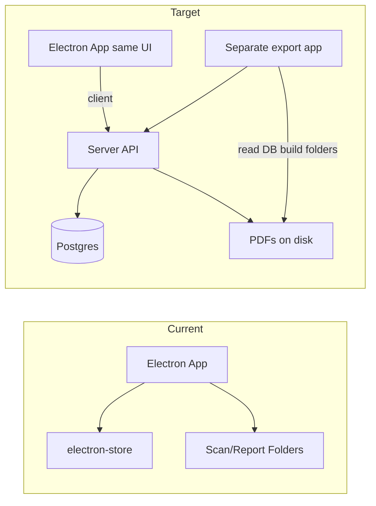

# Decentralized Server + DB Refactor Plan

## Current state (what you have now)

**Not "everything in files"** – there are two layers:

1. **electron-store (JSON on disk)**
  - **[config/store.js](config/store.js)** defines two stores:
    - **settingsStore** (`config`): rider items, night leads, folder paths (scan/report/einkaufsbelege/zeiterfassung), template paths, bestueckung lists, person-name catalogs (secu, tech, andere), wage options, person wages, tech names, catering/pauschale/bestueckung prices.
    - **shiftDataStore** (`shift-data`): current shift formData and currentPhase (VVA/SL).
  - Handlers read/write via `store.get()` / `store.set()` in [handlers/catalogHandlers.js](handlers/catalogHandlers.js), [handlers/settingsHandlers.js](handlers/settingsHandlers.js), [handlers/dataHandlers.js](handlers/dataHandlers.js), [handlers/reportHandlers.js](handlers/reportHandlers.js), [handlers/scannerHandlers.js](handlers/scannerHandlers.js), and [server/secuFormServer.js](server/secuFormServer.js).
2. **Files on disk**
  - **Scans**: PDFs written to `scanFolder` (e.g. `NightclubScans/{formFolder}/{date}/`). NAPS2 and the LAN form server ([server/secuFormServer.js](server/secuFormServer.js)) write here.
  - **On close-shift** ([handlers/reportHandlers.js](handlers/reportHandlers.js)): report PDF + section PDFs (Technik, Security, Belege, etc.) go into `reportFolder/{date}_{eventName}/`; Einkaufsbelege copied to `einkaufsbelegeFolder/{year}-{month}/`; Zeiterfassung Excel to `zeiterfassungExcelFolder/Zeiterfassung-{YYYY-MM}.xlsx`. Temp scan files are deleted after merge.
  - **Templates**: Paths in store; actual files live on disk. [utils/pdfGenerator.js](utils/pdfGenerator.js) and settingsHandlers read/write temp and template files.

So today: **state lives in two JSON stores; outputs (PDFs, Excel, folder structure) are written to configurable folders.**

---

## Target architecture

**Decisions (locked in):**

- **Database**: Postgres (separate container, good for multi-user and backups).
- **PDFs/scans**: Stored **on server disk** (volume or bind mount); DB holds file paths and metadata only.
- **Electron app**: **Stays as it is now** – same forms, same UI, same workflow. The only change is that **data no longer lives on the machine**: it's a **client** that talks to the server (catalogs, shift data, settings, document uploads) via API. No reimplementation of forms on the server.
- **Export / folder creation**: A **separate browser app** reads the database (via API) and creates the folders with report PDFs, section PDFs, Einkaufsbelege, Zeiterfassung Excel, etc.

**Components:**

- **Server** (different machine, **Docker container(s)**): The whole server runs as Docker – you host it on the other machine by running the container (or `docker compose up`). No need to install Node or Postgres on the host: one image for the Node API (and Secu form + export app if served from it), one for Postgres; volumes for DB and document storage. Postgres + Node API; stores events, catalogs, settings, document paths; receives form data and uploaded scans; writes PDFs/Excel to a storage volume; exposes API. **Security form (Secu)** at e.g. `/forms/secu` – mobile/tablet open the **server** URL. All other form UIs stay in Electron.
- **Electron app** (unchanged as the main app): Same app as today – same React forms, sidebar, shift flow, scanner (NAPS2). **Data layer only** changes: instead of electron-store and local file paths, it calls the server API. **Secu form server is removed from Electron** – the backend serves the Security form; Electron is no longer the "client" (form host) for Secu.
- **Separate browser app ("Export" / "Report builder")**: Web app that talks to the server API. Lets user pick events, then triggers creation of the folder structure (ZIP or write to path) with all PDFs and Excel.

High-level flow:

---

## Implementation outline

### 1. Server and database

- Add a **Node server** with **Express** in the repo (e.g. `server/` or a new `backend/`).
- **Database: Postgres** (separate container in Docker; use volume for persistence).
- **Documents: on disk** – server writes PDFs/Excel to a configured directory (Docker volume or bind mount); DB stores **file path** and metadata only (event_id, type, section_or_name, content_type). No blobs in DB.
- **Schema (conceptual)**:
  - **Events/shifts**: id, eventName, date, doorsTime, phase, formData (JSON or normalized tables), createdAt, etc.
  - **Catalogs**: rider_items, night_leads, person_names (type: secu/tech/andere), bestueckung_lists, wage_options, person_wages, tech_names, prices (catering, pauschale, bestueckung).
  - **Settings**: template paths (or uploads stored on disk), optional folder-path preferences for export app.
  - **Documents**: event_id, type (scan/report/section/einkaufsbeleg/zeiterfassung), section_or_name, **file_path** (relative or absolute on server), content_type. Enough for the export app to know which file goes where in the folder structure.

### 2. API surface (server)

- **Events/shifts**: create, get, update, list; "close shift" = finalize event, generate report + section PDFs and Excel, write files to server disk, store document rows (paths) in Postgres.
- **Catalogs & settings**: CRUD for rider items, night leads, person names, bestueckung, wages, prices, template paths (or upload templates to server disk).
- **Documents**: upload scan PDF (multipart) → server saves file to disk, inserts document row with file_path. Get document by id (stream file from path). List documents by event.
- **No "export to folder" in main API** – folder creation is done by the separate export app (see below).

### 3. Electron app as client (same app, data on server)

- **Electron app stays as it is** – same forms (Uebersicht, Secu, Tontechnik, Kassen, Rider Extras, Gaeste, etc.), same sidebar, same shift flow. Only the **data layer** changes: replace electron-store and local file I/O with **API calls** to the server (configurable server URL in settings). Load/save shift data, catalogs, settings via API; upload scan PDFs to server after NAPS2 scan; close-shift sends formData to server, server generates report + section PDFs and Excel, writes to server disk, stores paths in DB.
- **Security form (Secu)**: **Served by the backend server**, not by the Electron app. Users (e.g. on mobile) open the **server** URL (e.g. `http://server/forms/secu`); submit goes to server API; server generates PDF, saves to disk, inserts document row. Electron app **no longer runs** the Secu form HTTP server – the server shouldn't be the "client" (form host) anymore; the backend is the form host for Secu.
- **Scanner**: Still NAPS2 in Electron. After scan, instead of writing to local `scanFolder`, upload file to server (multipart); server saves to disk and links to current shift/event. Form data (e.g. `scannedDocuments` with file references) uses server document IDs or URLs instead of local paths.

**Sync to server (how we push):**

- **When**: Push shift state (formData + currentPhase) to the server in these cases:
  1. **Debounced after form changes** – e.g. 2–3 seconds after the last change to formData. Use the same trigger that currently calls `save-data` (e.g. from [useFormData.js](src/hooks/useFormData.js) or form `onChange`), but call the API client; debounce the API call.
  2. **On phase change** – when the user switches from VVA to SL (or back), push immediately.
  3. **On close-shift** – full formData is already sent as the body of the close-shift request.
  4. **On app going to background / before quit** (optional) – one last push.
- **What**: Send **full formData and currentPhase** in one request: `PATCH /api/events/:id` (or `PUT`) with body `{ formData, currentPhase }`. Server overwrites the event's formData and phase.
- **Failure**: If the push fails: keep the latest state in local cache, show "Sync fehlgeschlagen, wird erneut versucht" and **retry** with backoff. Don't block editing. On next app open, load from server first; if server is down, show cached shift and keep retrying.
- **Catalogs and settings**: Sync on change – call the corresponding API (POST/PATCH/DELETE) immediately when the user adds/edits. No debounce for catalog updates.

### 4. Separate browser app: read DB and create folders

- **Dedicated web app** (e.g. `apps/export-app/`): Connects to the server API. Shows list of events, user selects event(s), then triggers "create folders with everything."
- **Folder creation**: App calls **export API** on the server: (1) reads event + documents from Postgres and file paths from disk, (2) builds the same structure as today (`{date}_{eventName}/`, report PDF, section PDFs, Einkaufsbelege, Zeiterfassung Excel), (3) returns a **ZIP** for download, or writes to a path and returns success. Reuse [utils/pdfGenerator.js](utils/pdfGenerator.js), [utils/secuFormPdf.js](utils/secuFormPdf.js), [utils/zeiterfassungExcel.js](utils/zeiterfassungExcel.js) and layout logic from [handlers/reportHandlers.js](handlers/reportHandlers.js) on the server.

### 5. Deployment: server as Docker on the other machine

- **Server stack = one docker-compose file.** The whole server (API + Postgres + volumes) is defined in `docker-compose.yml`; you host it on the other machine by running `docker compose up -d` – no Node or Postgres on the host.
- **Setup**: Dockerfile for Node backend; docker-compose with **api** + **postgres** services; volumes for Postgres data and **document storage** (e.g. `storage_data`). Expose API port (e.g. 3000). Run `docker compose up -d` on the host.
- **Electron**: Add "Server URL" setting; all data operations go through that API.
- **Migration**: One-time script: read existing electron-store + scan/report folders, create events and document rows in Postgres, copy or upload PDFs/Excel to server storage path.

---

## Step-by-step implementation plan

Order of work: **Phase 1** (backend + Docker) → **Phase 2** (Electron as client) → **Phase 3** (export app) → **Phase 4** (migration) when needed.

### Progress – tick when done (`[x]`):

- **Phase 1: Backend**
  - [ ] 1. Backend project structure
  - [ ] 2. Postgres schema and migrations
  - [ ] 3. Storage directory
  - [ ] 4. API: health and config
  - [ ] 5. API: catalogs and settings
  - [ ] 6. API: events/shifts
  - [ ] 7. API: documents
  - [ ] 8. Secu form on backend
  - [ ] 9. API: close-shift
  - [ ] 10. Docker (Dockerfile + docker-compose)
- **Phase 2: Electron client**
  - [ ] 11. Server URL in Electron
  - [ ] 12. API client in main process
  - [ ] 13. Handlers: catalogs and settings
  - [ ] 14. Handlers: shift data
  - [ ] 15. Scanner: upload to server
  - [ ] 16. Close-shift: call server
  - [ ] 17. Remove Secu form server from Electron
  - [ ] 18. Preload and renderer
- **Phase 3: Export app**
  - [ ] 19. Export API on server
  - [ ] 20. Export web app
- **Phase 4: Migration and cleanup**
  - [ ] 21. Migration script
  - [ ] 22. Cleanup

*Tip: use commit messages like `refactor: Phase 1 step 1 - backend structure` so git log also shows progress.*

---

### Phase 1: Backend server and database

1. **Backend project structure** – Create backend (e.g. `backend/`). Add `package.json`, install Express, pg, multer. Single entry point (e.g. `backend/index.js`) that starts the HTTP server.
2. **Postgres schema and migrations** – Define schema: events, catalogs, settings, documents. Raw SQL migrations in `backend/migrations/` (e.g. `001_initial.sql`); run in order via small Node script or `psql`. Use **pg** for all queries (parameterized: `$1`, `$2`).
3. **Storage directory** – Env var `STORAGE_PATH`. On startup, ensure directory exists. All PDF/Excel writes go under this root; DB stores paths relative to it.
4. **API: health and config** – `GET /api/health`, `GET /api/current-event` for Secu form (event name/date/doors). No auth for now.
5. **API: catalogs and settings** – CRUD for rider items, night leads, person names (by type), bestueckung, wages, prices, tech names, templates. Mirror current store shape.
6. **API: events/shifts** – `GET /api/events`, `GET /api/events/current`, `POST /api/events`, `GET /api/events/:id`, `PATCH /api/events/:id` (formData, phase).
7. **API: documents** – `POST /api/events/:id/documents` (multipart), save to STORAGE_PATH, insert document row. `GET /api/events/:id/documents`, `GET /api/documents/:id` (stream file).
8. **Secu form on backend** – Serve static form at `GET /forms/secu`. `POST /api/forms/secu/submit`: accept JSON, get current event, generate PDF (secuFormPdf), write to storage, insert document row.
9. **API: close-shift** – `POST /api/events/:id/close` with full formData. Server: generate report PDF, section PDFs, Zeiterfassung Excel; write to storage; insert document rows; set event phase to closed.
10. **Docker** – Dockerfile for Node backend; docker-compose: api + postgres, volumes for DB and document storage. `.env.example`: PORT, DATABASE_URL, STORAGE_PATH. Run `docker compose up -d`; verify with `GET /api/health`.

### Phase 2: Electron app as client

11. **Server URL in Electron** – Add "Server URL" to settings (persist in electron-store). Default e.g. `http://localhost:3000` for dev.
12. **API client in main process** – New module: given base URL, implement fetch wrappers for all backend endpoints (catalogs, settings, events, documents, close-shift). Handle errors and offline.
13. **Handlers: catalogs and settings** – If server URL set, call API client instead of store; same IPC channel names. Optional fallback to store when offline.
14. **Handlers: shift data** – save-data → API PATCH (debounced 2–3 s); load-data → API GET current event; clear-shift-data → API or local reset. Cache last synced formData for offline display; retry on failure.
15. **Scanner: upload to server** – After NAPS2, upload PDF via API client to current event's documents; return document id to renderer. Form stores server document id instead of local path.
16. **Close-shift: call server** – POST formData to `POST /api/events/:id/close`; remove local report generation (or keep behind "no server" branch). Show success/error.
17. **Remove Secu form server from Electron** – Stop `createLanFormServer` in main.js; remove/stub secuFormServer.js. In settings, show "Security-Zettel Formular: [Server-URL]/forms/secu".
18. **Preload and renderer** – Keep existing IPC API; update any renderer code that expects local paths for scans to use document id/URL.

### Phase 3: Export app (browser)

19. **Export API on server** – `GET /api/events` (list). `POST /api/export/event/:id` – build folder structure from DB + disk, zip, stream response. Optionally `POST .../to-path` with basePath.
20. **Export web app** – New app (e.g. `apps/export-app/`): fetch events, select event, click Export → receive ZIP, trigger download. Deploy as static under backend (e.g. `/export`) or separate host.

### Phase 4: Migration and cleanup

21. **Migration script** – Read electron-store + existing folders; create event/document rows in Postgres; copy PDFs/Excel to STORAGE_PATH. Run against running backend.
22. **Cleanup** – Remove legacy store usage (keep server URL + optional fallback), Secu form server in Electron, local report writing. Update README: server URL, Docker, export app URL, Secu form URL.

---

## Key files to touch

| Area | Files |
|------|------|
| Store / config | [config/store.js](config/store.js) – keep for local fallback or remove once fully on server |
| Shift & catalog data | [handlers/dataHandlers.js](handlers/dataHandlers.js), [handlers/catalogHandlers.js](handlers/catalogHandlers.js), [handlers/settingsHandlers.js](handlers/settingsHandlers.js) – switch to server API |
| Reports & close-shift | [handlers/reportHandlers.js](handlers/reportHandlers.js) – move close-shift logic to server; client calls API |
| Scans & Secu form | [handlers/scannerHandlers.js](handlers/scannerHandlers.js) – upload to server. Secu form: move from [server/secuFormServer.js](server/secuFormServer.js) to backend; remove from Electron |
| PDF/Excel generation | [utils/pdfGenerator.js](utils/pdfGenerator.js), [utils/secuFormPdf.js](utils/secuFormPdf.js), [utils/zeiterfassungExcel.js](utils/zeiterfassungExcel.js) – run on server |
| Electron client | [preload.js](preload.js), handlers, hooks – server URL; replace store/file I/O with API calls |
| Export app | New: browser app that calls server API to list events and trigger export (ZIP) |
| Docker / deployment | New: `Dockerfile`, `docker-compose.yml`, `.env.example` |

---

## Decisions (locked in)

- **DB**: Postgres.
- **PDFs/scans**: On server disk (paths in DB).
- **Electron app**: Unchanged as main app (same forms, UI, flow); **data** moves off the machine – it's a client talking to the server API.
- **Export**: Separate browser app that reads the DB (via API) and creates the folders (ZIP or write to path via server).
- **Shift state while open**: Primary on server; optional local cache for resilience. Debounced push; retry on failure.
- **Server stack**: **Docker Compose** – one `docker-compose.yml` (api + postgres + volumes). Host with `docker compose up -d`.
- **Backend framework**: **Express** (multer for uploads, pg for Postgres).
- **Database layer**: **Raw SQL with pg** (no ORM). Migrations = SQL files run in order.
